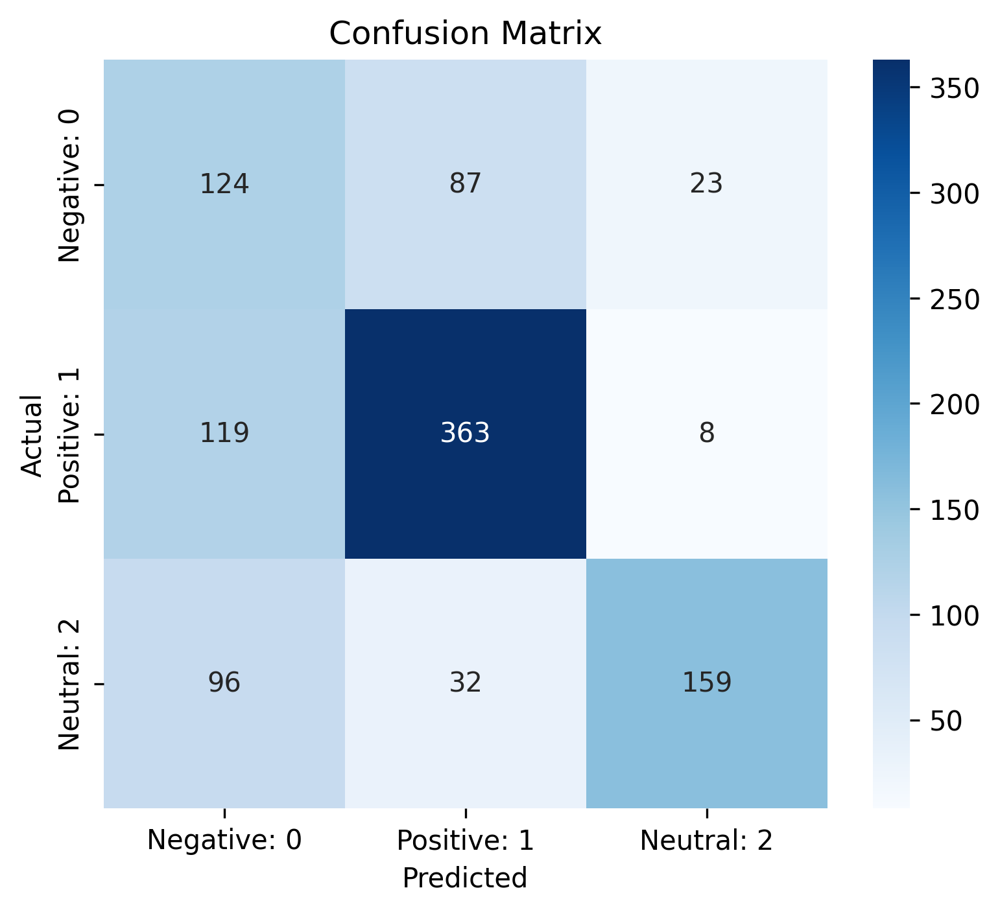
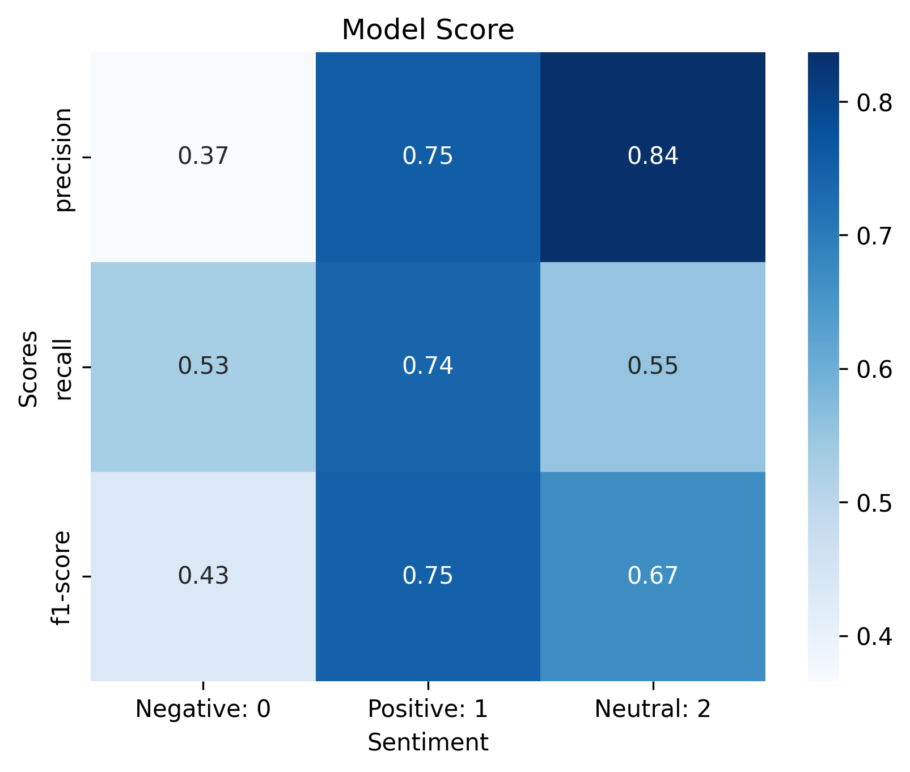

# reddit-sentiment-classifier
An **NLP + LSTM based sentiment classifier** trained on Reddit comments to predict **positive, negative, or neutral sentiment**.

This project demonstrates end-to-end workflow:

* Collecting data from Reddit API
* Cleaning and preprocessing text
* Embedding using gensim model
* Training an LSTM deep learning model
* Evaluating model performance
* Visualizing sentiment distribution and insights

---

## 📂 Project Structure

```
├── data/                # Datasets (Reddit comments, posts)
├── notebooks/           # Jupyter notebooks (EDA + modeling)
│   └── Sentiment_Analysis.ipynb
├── plots/               # Saved plots/visualizations
├── requirements.txt     # Project dependencies
├── README.md            # Project documentation
```

---

## ⚙️ Installation & Setup

1. Clone the repository:

```bash
git clone https://github.com/princerg/reddit-sentiment-classifier.git
cd reddit-sentiment-classifier
```

2. Install dependencies:

```bash
pip install -r requirements.txt
```

3. If collecting fresh data, configure your **Reddit API**:

   * Go to [Reddit Apps](https://www.reddit.com/prefs/apps)
   * Create an application → get `client_id`, `client_secret`, and `user_agent`
   * Update them in the notebook before running

---

## 📊 Dataset

* `reddit_sentimnt_vader.csv` → Cleaned comments with sentiment labels
* `reddit_posts.csv` → Metadata about posts
* `comments.csv` → Filterd data from `reddit_posts.csv`

Data was collected using the **PRAW (Python Reddit API Wrapper)** library.

---

## 🧠 Model

* Preprocessing: tokenization, stopword removal, padding
* Embedding layer with FastText model (genism library)
* LSTM layers for sequential modeling
* Softmax classifier for 3 sentiment classes

---

## 📈 Results & Insights

### 📌 Model Performance
| Metric    | Score |
|-----------|-------|
| Accuracy  | 64%   |
| Precision | 0.65  |
| Recall    | 0.61  |
| F1-score  | 0.62  |


* Model achieves **64% accuracy**.
* **Positive comments** dominate in subreddits focused on brand **samsung**.
* **Negative comments** are less likely predicted because of data imbalance.
* Visualization of sentiment distribution:




---

## 🎯 Example Predictions
| Comment                             | Predicted Sentiment |
|-------------------------------------|---------------------|
| "The ride was so awesome!"          | Positive            |
| "this product is bad"               | Negative            |
| "I don't know what it eat toninght" | Neutral             |

---

## 🚀 Future Improvements

* Integrate real-time brand sentiment tracking using Reddit API (streaming comments as they are posted).
* Build a competitor analysis dashboard to compare sentiment across multiple brands or companies.
* Explore transformer-based models (BERT) for higher accuracy.
* Deploy as an interactive Streamlit app with live charts.

---

## 📝 License

- This project is licensed under the MIT License.

